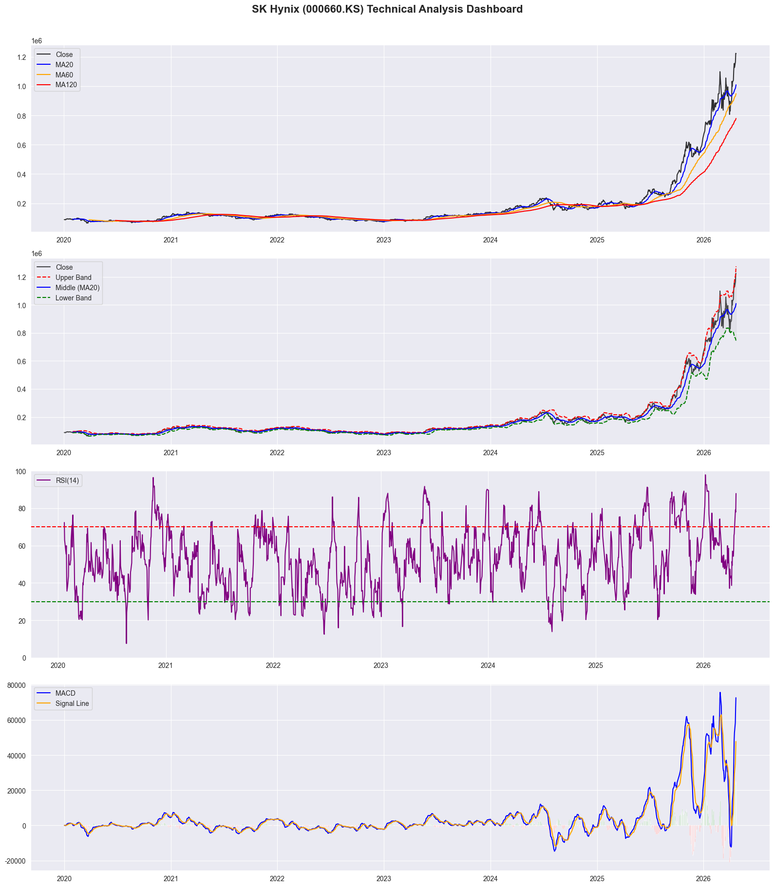
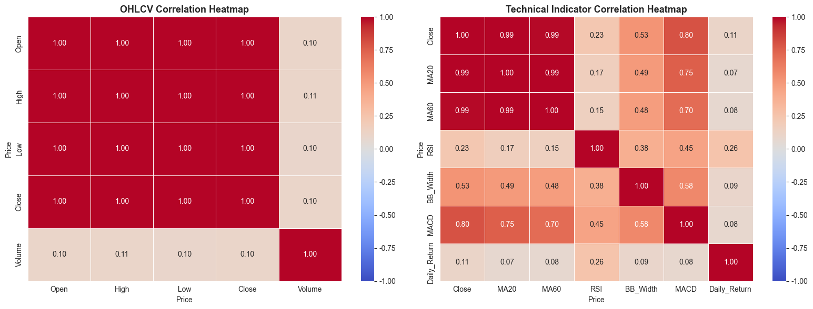
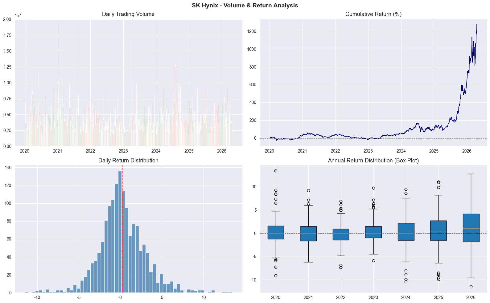
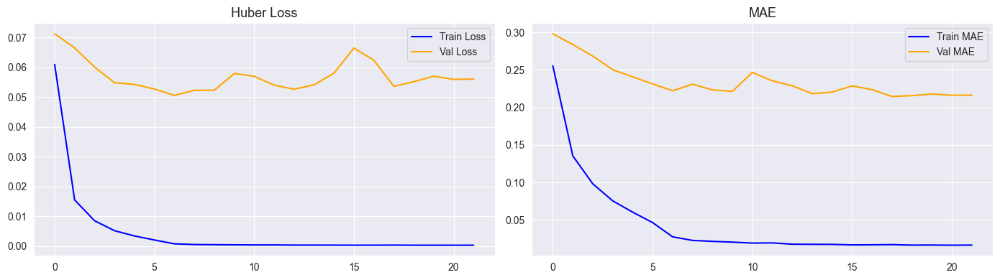
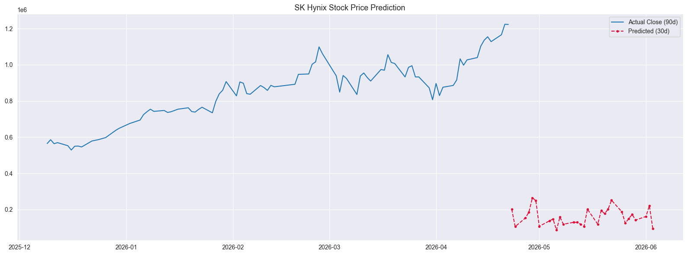
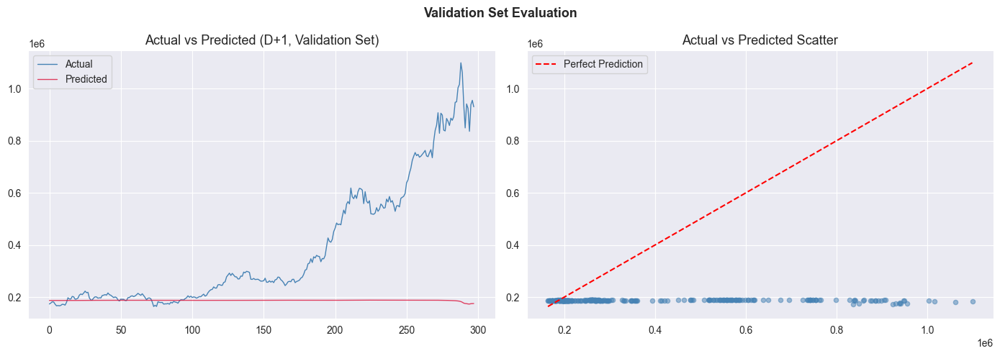

# 📊 SK Hynix Stock Price Analysis & Prediction Portfolio

### SK하이닉스(000660.KS)의 시계열 데이터와 기술적 지표를 분석하고, Bidirectional LSTM 모델을 적용하여 향후 30일간의 주가 흐름을 예측하는 인공지능 및 데이터 엔지니어링 포트폴리오.


---

## 📌 프로젝트 요약 (Project Overview)
본 프로젝트는 SK하이닉스(000660.KS)의 2020년부터 현재까지의 일봉 데이터를 바탕으로 탐색적 데이터 분석(EDA)과 기술적 지표 분석을 수행하고, Bidirectional LSTM 모델을 활용하여 향후 30일간의 주가 추이를 예측한 데이터 파이프라인 구축 사례입니다.


## 📂 프로젝트 구조 (Project Structure)
```text
skhynix-stock-analysis/
├─ plots/                   # 분석 결과 시각화 이미지 저장 폴더
├─ src/
│  └─ main.py               # 전체 분석 파이프라인 통합 실행 스크립트
├─ .gitignore                      
├─ LICENSE                         
├─ README.md                # 프로젝트 개요 및 가이드 문서
└─ requirements.txt         # 핵심 라이브러리 목록
```

---

## 🔍 분석 흐름 및 시각화 결과 (Section 1 ~ 10)

| 단계 | 분석 과정 | 상세 내용 및 결과 시각화 |
| :---: | :--- | :--- |
| **Section 1-3** | **데이터 수집 및 EDA** | `yfinance` 데이터 로드 및 기초 통계량 검토 |
| **Section 4-5** | **기술적 지표 및 대시보드** | MA, RSI, Bollinger Bands, MACD 지표 생성 및 시각화<br><br> |
| **Section 6** | **상관관계 분석** | OHLCV 및 기술 지표 간 상관계수 히트맵 도출<br><br> |
| **Section 7** | **수익률 분석** | 누적 수익률 및 연간 수익률 분포 분석<br><br> |
| **Section 8** | **Bi-LSTM 모델 학습** | Huber Loss 기반 학습 곡선 확인<br><br> |
| **Section 9** | **미래 주가 예측** | 최근 데이터를 기반으로 향후 30일 주가 궤적 예측<br><br> |
| **Section 10** | **모델 평가** | 검증 세트 실제값 vs 예측값 비교 분석<br><br> |

---

💡 회고록 (Retrospective)
데이터 한계 확인: 과거의 가격 및 거래량 데이터(OHLCV)에만 의존한 딥러닝 모델링의 본질적인 한계를 확인했습니다.

모델 성능 평가: 검증 세트의 R2 Score가 음수(-1.1272)로 산출되었으며, 이는 비정형적인 외부 이벤트가 잦은 주식 시장에서 단순 시계열 패턴만으로는 유의미한 미래 예측을 수행하기 어렵다는 점을 시사합니다.

개선 방안 (Future Work): 향후 반도체 시장의 거시 경제 지표(환율, 금리) 및 뉴스 텍스트 데이터를 활용한 감성 분석(Sentiment Analysis) 지수를 파생 변수로 추가하여 모델의 설명력을 개선할 계획입니다.

프로젝트 의의: 본 분석은 주가 예측 모델링의 전체 사이클을 직접 구현하고 평가하는 데 목적이 있으며, 데이터 파이프라인 구축 및 시계열 딥러닝 모델 적용 역량을 증명합니다.

## 💡 회고 (Retrospective)

### "숫자는 거짓말을 하지 않지만, 과거가 미래를 보장하지는 않는다."

딥러닝을 활용한 주가 예측은 데이터 분석 공부를 시작할 때부터 꼭 도전해보고 싶었던 과제였습니다. 하지만 이번 프로젝트를 통해 데이터의 양보다 중요한 것은 **데이터가 담고 있는 정보의 질**이라는 것을 뼈저리게 느꼈습니다.

**1. 데이터 소스의 한계와 갈증**
단순히 과거의 가격과 거래량(OHLCV) 정보만으로 딥러닝 모델을 학습시키는 것은, 마치 시험 범위가 아닌 교과서만 보고 내일의 난이도를 예측하는 것과 같았습니다. 차트 속의 숫자에는 반도체 업황, 거시 경제, 글로벌 공급망 등 시장의 흐름을 결정짓는 핵심 맥락이 빠져 있었습니다. 데이터 엔지니어링 관점에서 더 넓은 범위의 데이터를 수집하고 정제하는 파이프라인 구축의 중요성을 실감했습니다.

**2. R2 Score -1.1272가 가르쳐준 것**
검증 세트에서 산출된 음수(-)의 R2 Score를 마주했을 때의 당혹감은 잊을 수 없습니다. 모델이 단순 평균으로 예측하는 것보다도 못한 성능을 보였다는 것은, 단순히 모델의 레이어를 깊게 쌓는다고 해결될 문제가 아니라는 신호였습니다. 주식 시장의 강한 비정형성과 무작위성 앞에서는 정교한 알고리즘 이전에 **도메인 지식에 기반한 피처 엔지니어링**이 선행되어야 함을 배웠습니다.

**3. 앞으로의 과제 (Future Work)**
실패한 예측 결과는 오히려 제가 공부해야 할 방향을 명확히 제시해주었습니다.
* **멀티모달 데이터 활용:** 뉴스 헤드라인과 반도체 커뮤니티의 텍스트 데이터를 감성 분석(Sentiment Analysis) 지수로 변환하여 모델에 입력할 예정입니다.
* **외부 변수 확장:** 환율, 금리, 그리고 나스닥 반도체 지수(SOX)와 같은 상관관계가 높은 외부 경제 지표를 파이프라인에 포함시키는 고도화 작업을 계획하고 있습니다.

**4. 마치며**
비록 예측 정확도는 기대에 미치지 못했지만, 데이터 수집부터 모델 배포 및 시각화까지의 **전체 분석 라이프사이클을 스스로 설계하고 구현**해냈다는 점에서 큰 의미가 있었습니다. 기술적인 구현 능력을 넘어, 모델의 한계를 객관적으로 인정하고 개선점을 찾아내는 엔지니어의 자세를 가질 수 있었던 값진 경험이었습니다.
